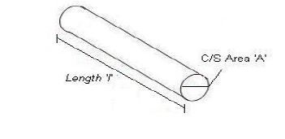
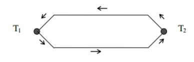
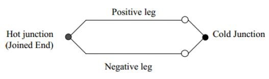
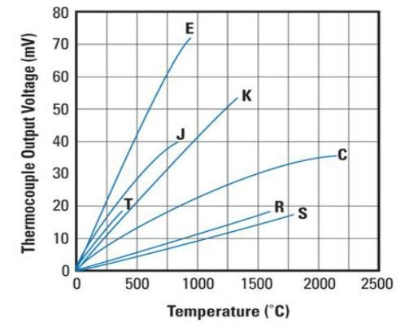
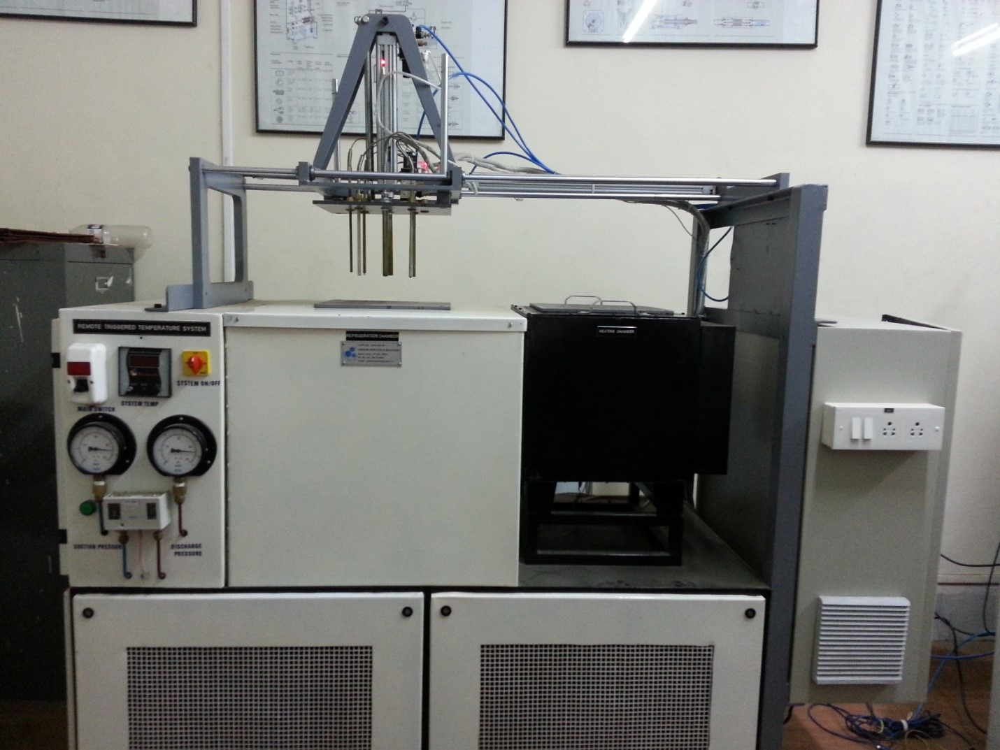
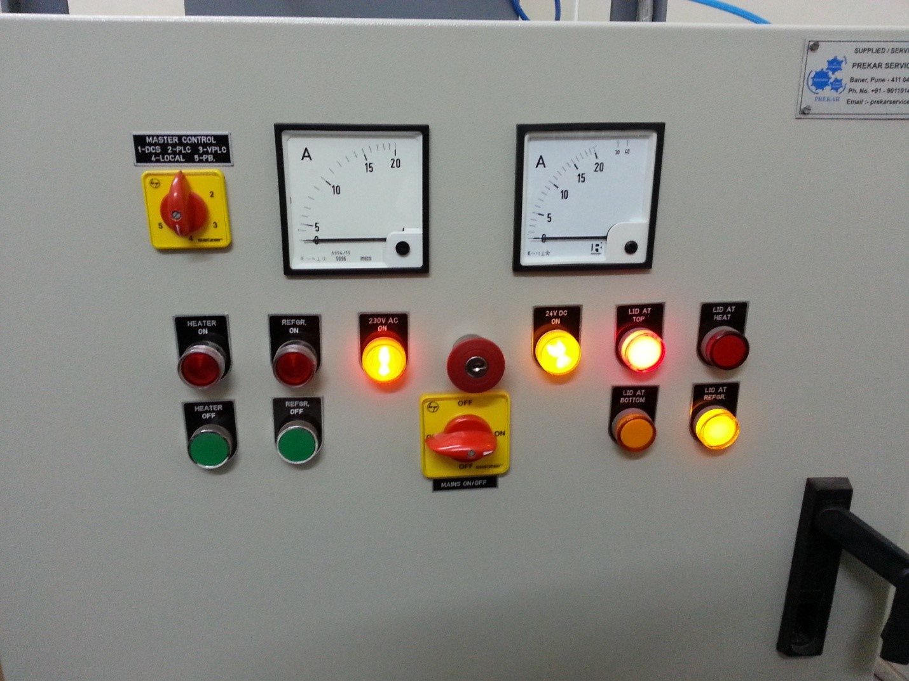
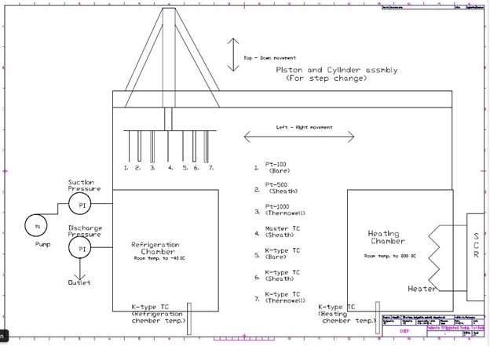

## Theory

Temperature is a measure of the average heat or thermal energy of the particles in a substance. Since it is an average measurement, it does not depend on the number of particles in an object. In that sense it does not depend on the size of it. For example, the temperature of a small cup of boiling water is the same as the temperature of a large pot of boiling water. Even if the large pot is much bigger than the cup and has millions and millions more water molecules. The basic unit of temperature (T) in the International System of Units (SI) is the Kelvin (K). The commonly used other units of temperature are Degree Celsius (°C) and Degree Fahrenheit (°F).

#### Electrical Resistance

The electrical resistance of an object is a measure of its opposition to the flow of an electric current. For a wide range of materials and conditions, the electrical resistance does not depend on the amount of current through or the potential difference (voltage) across the object. That means the resistance R is constants for the given temperature and material. Therefore, the resistance of an object can be defined as the ratio of voltage to current, in accordance with Ohm’s Law: 

R = V/I

The unit of resistance is ohm (Ω).

#### Resistance Temperature Detector (RTD)

For measurement of Temperature number of sensors are available. One of the most linear, stable, and reproducible temperature sensors is the RTD, Resistance Temperature Detector. In RTD, the output resistance changes with temperature. RTD is a positive temperature coefficient device. The resistance of the metal increases with temperature. The resistive property of the metal is called its resistivity. The resistive property defines length and cross sectional area required to fabricate an RTD of a given value. The resistance is proportional to length and inversely proportional to the cross sectional area and is given by the relationship. 

R = ρl/A

 Where 'R' is resistance of the metal, 'ρ' is the resistivity of the metal, 'l' is the length of the metal and 'A' is the area of cross section of the metal.

#### RTD

Resistance Temperature Detector (RTD), as the name implies, is a sensor used to measure temperature by correlating the resistance with temperature. Most RTD elements consist of a length of fine coiled wire wrapped around a ceramic or glass core. The element is usually quite fragile, so it is often placed inside a sheathed probe to protect it. The RTD element is made from pure metals as mentioned below. The material property to have predictable change in resistance as the temperature changes is used to determine temperature.

#### Commonly used RTD Materials

-	Platinum (most popular and accurate) 
-	Nickel 
-	Copper 
-	Balco (rare) 
-	Tungsten (rare)

#### Thermowells 

Thermowells are used to protect temperature probes installed in industrial processes. Thermowells are described as a closed-end tube designed to protect temperature sensors from harsh environments, high pressure and flow. Thermowells provide threads or a flange for mounting to the process or vessel. They can be installed into a system by pipe thread of welded flange. Typically thermowells are made of a corrosion-resistant metal and can be customized based on the application. 
The temperature sensor probe is inserted at the open end of the thermowell tube. Within the process fluid transfers heat to the thermowell wall, the heat is then transferred to the temperature sensor. With the additional mass of the thermowell, the response time of the sensors can be delayed. However, thermowells allow for easy replacement of a failed temperature sensor.

#### Materials used for Thermowells

-	Carbon Steel. 
-	Stainless steel SS304,SS316 etc 
-	Monel 
-	Brass 

#### Types of Thermowells 

-	Threaded thermowells. 
-	Flanged thermowells -- includes raised face, flat face, and ring joint (RJT) flanged thermowell constructions. 
-	Van Stone / Lap Joint flanged thermowells 
-	Weld-in thermowells. 
-	Sockets weld thermowells. 
-	Sanitary Cap Thermowells (3-A Certified) 
-	Sanitary Weld-In Thermowells (3-A Certified) 

#### Thermocouple 

- In 1821, Thomas Seebeck discovered if metals of two different materials were joined at both ends and one end was at a different temperature than the other, a current was created. This phenomenon is known as the Seebeck effect and is the basis for all thermocouples. 

-	A thermocouple is a type of temperature sensor, which is made by joining two dissimilar metals at one end. The joined end is referred to as the HOT JUNCTION.The other end of these dissimilar metals is referred to as the COLD END or COLD JUNCTION. The cold junction is actually formed at the last point of thermocouple material.

-	Certain combinations of metals must be used to make up the thermocouple pairs. 

-	If there is a difference in temperature between the hot junction and cold junction, a small voltage is created. This voltage is referred to as an EMF (electro-motive force) and can be measured and in turn used to indicate temperature. 

-	The voltage created by a thermocouple is extremely small and is measured in terms of millivolts (one millivolt is equal to one thousandth of a volt). In fact, the human body creates a larger millivolt signal than a thermocouple. 

-	To establish a means to measure temperature with thermocouples, a standard scale of millivolt outputs was established. This scale was established using 32 deg. F (0°C) as the standard cold junction temperature (32 deg. F (0°C) = 0 millivolts output). 

#### COLD JUNCTION COMPENSATION

-	As we mentioned earlier, the last point of thermocouple material is known as the cold junction. The amount of output the t/c produces is determined by the difference between the hot junction and the cold junction temperatures. The cold junction temperature must be known to accurately determine the temperature. 

#### Let's look at the following examples: 

-	If we had a thermocouple in a heat treat furnace and wanted to know what temperature it was in that furnace, we could attach a voltmeter to the cold junction and measure the voltage. 
-	Let’s say that the furnace is operating at 1000 deg. F. and it is 100 deg. F at the cool end of the T/C. Since we said that a T/C measures the difference between the hot and cold junctions, our formula would be: 
1000 t junction) - 100 (cold junction) = 900 deg. F.
-	There seems to be a problem since we said that the furnace was at 1000 deg. F. This brings us to COLD JUNCTION COMPENSATION. 

-	COLD JUNCTION COMPENSATION is usually done automatically by the measuring instrument. The instrument measures the temperature at the cold junction and adds it back to the equation. 
1000 (hot junction) - 100 (cold junction) = 900 deg. F + 100 deg. F
(cold junction temp) = 1000 deg F

-	This way the instrument indicates the actual temperature of the hot junction. 

-	This COLD JUNCTION compensator is usually located at the terminals on the back of the indicating instrument and you must maintain T/C material all the way to this point. 
-	For a thermocouple to function properly, there must be no other metals used between the hot junction and the cold junction. If wire is needed to connect the T/C to the indicating instrument, the lead wire must be made of the same material as the T/C. 

-	It is acceptable to use terminal blocks and lugs made of plain copper in a thermocouple circuit as long as the positive and negative terminals are at the same temperature. (Example: terminal blocks in heads or spade lugs on wire). 

-	If you were to use plain copper wire instead of T/C extension wire to run to the instrument, your cold junction would be formed at the junction between the copper and the T/C wire. This junction would most likely not be at the same temperature as the back of the instrument where the compensator is located. This would then create an error in the indicated temperature. 

-	If a customer were to use the wrong T/C extension wire, the same problem could appear. This is why we must use the correct T/C extension wire on our assemblies. 

-	It is also acceptable to have a third metal in the hot junction as long as that metal is at the same temperature as the thermocouple material. 

#### Temperature Sensor Plant

#### Major Hardware 

-	Refrigerator (upto - 40 oC) 
-	Heater (upto 800 oC) 
-	RTD three types : - Pt 100 bare, Pt 500 and Pt 1000 
-	Thermocouple: - K Type (5 nos.) 
-	Master Reference temperature sensor: - K Type. 

#### P & ID of Temperature sensor Plant 

